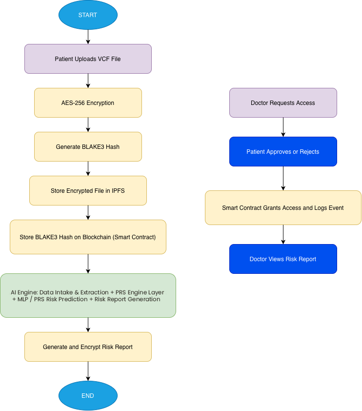
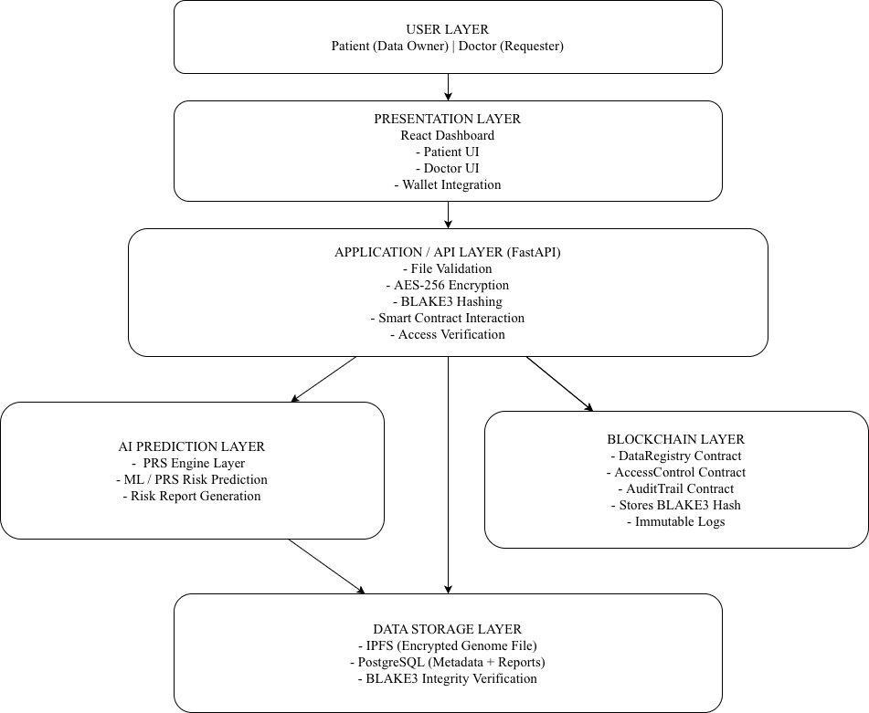

  

**Polygenic Risk Intelligence for Secure Medicine (PRISM): A Decentralized AI-Powered Genomic Data Ownership & Risk Intelligence Platform**

  <a href="http://13.62.224.105:3000/"><strong>Demo website</strong></a>

---

## 1. Project Overview

### 1.1 Team: Mangzing

| Role | Member |
|:---|:---|
| **Blockchain Developer & UI/UX Designer** | Khumbongmayum Yaiphaba Singh |
| **AI/ML Engineer** | Chingkheinganba Thoudam |
| **Backend & Frontend Developer** | Thongam Gripson Singh |

**Concept Video:** [View Presentation](https://youtu.be/a8waELYlxZ0)
**Demo Video:** [View Presentation](https://youtu.be/5KAOu703DpA)
---

## 2. System Architecture & Diagrams

### System Workflow

### Architecture Visualization

---

## 3. The Problem Landscape

Genomic data represents one of the most sensitive categories of personal identifiable information. However, contemporary healthcare systems exhibit significant vulnerabilities:
- Genetic records are predominantly stored in centralized, siloed databases.
- Patients are afforded limited sovereignty and control over data access.
- Centralized repositories represent high-value targets, vulnerable to data breaches and unauthorized tampering.
- There is a systemic lack of transparent, immutable audit mechanisms for data utilization.

> **Fundamental Issue: Individuals do not possess true cryptographic ownership of their genomic data.**

**The Core Problem:**
Currently, no secure, patient-controlled, tamper-proof infrastructure exists to facilitate genomic data sharing while simultaneously leveraging AI-driven predictive insights for preventive medicine.

### 3.1 Target Audience
- Individuals who have undergone genomic sequencing.
- Hospitals, clinics, and diagnostic laboratories.
- Precision medicine researchers and academic institutions.
- Healthcare technology startups.

### 3.2 Clinical & Technological Context
- The exponential rise of precision medicine.
- A marked increase in global healthcare data breaches.
- The expanding adoption of consumer genomics.
- The maturation of blockchain networks for secure digital identity and decentralized consensus.

Current systems inherently fail to ensure **Data Sovereignty**, **Tamper-Proof Storage**, and **Transparent Access Control**.

---

## 4. Proposed Solution & Unique Value Proposition

### 4.1 Solution Overview
**PRISM Genomics** proposes a decentralized genomic intelligence architecture wherein:
1. Genomic data files are encrypted client-side using **AES-256**, and **BLAKE3 hashing** is utilized to ensure unquestionable data integrity.
2. Encrypted datasets are distributed across the **InterPlanetary File System (IPFS)**, while cryptographic hash fingerprints are committed to an immutable **blockchain** ledger.
3. A **Deep Learning Artificial Neural Network (MLP)** interfaces with the data to predict disease risk through the evaluation of polygenic risk patterns.
4. Medical professionals and researchers request data access via automated **smart contracts**.
5. Patients exercise absolute sovereign control, approving or rejecting access requests cryptographically via their digital wallets.
6. All access events and state changes are logged **immutably** on the blockchain.

### 4.2 Unique Selling Proposition (USP)
- **True Patient Data Sovereignty:** Absolute cryptographic control over data dissemination.
- **Advanced Cryptographic Integrity:** Implementation of AES-256 encryption coupled with BLAKE3 cryptographic hashing.
- **Zero-Knowledge On-Chain Storage:** No raw genomic data is ever stored on the blockchain; only IPFS CIDs and hash fingerprints.
- **AI-Powered Predictive Diagnostics:** Deep learning inference engine for disease risk stratification.
- **Smart Contract Governance:** Automated, trustless, and decentralized access control.
- **Immutable Audit Trails:** A transparent, non-repudiable history of all data interactions.

*In contrast to traditional Electronic Health Record (EHR) systems, PRISM Genomics synthesizes predictive intelligence, decentralized cryptographic security, and absolute patient sovereignty.*

---

## 5. Technical Architecture & Stack

### 5.1 Core Logic & Methodology
1. **Biological & Algorithmic Logic:**
   - Intersect the ClinVar database (Pathogenic/Benign clinical annotations) with 1000 Genomes project samples.
   - Extract and encode genotypes computationally (0, 1, 2 alleles) and impute sparse data utilizing population statistical averages.
   - Train a PyTorch Neural Network (Multilayer Perceptron) on empirical genetic risk distributions.
   - Output quantified disease risk probabilities and identify high-impact pathogenic variants.
2. **Security & Storage Logic:**
   - AES-256 symmetric encryption protocol for robust file protection.
   - BLAKE3 hashing algorithm for high-throughput, tamper-proof integrity verification.
   - IPFS protocol for decentralized, fault-tolerant storage.
3. **Blockchain Logic:**
   - Solidity smart contracts deployed on Ethereum-compatible networks to handle access control states and audit events.

### 5.2 Technology Stack
| Layer | Technologies Utilized |
|:---|:---|
| **Frontend GUI** | Next.js, Tailwind CSS, Recharts,Web3 Wallet Integration |
| **Backend Services & APIs** | FastAPI, Uvicorn, Prisma ORM, Web3.py, Supabase (PostgreSQL - Database Only) |
| **Artificial Intelligence & Data Engineering**| Python, PyTorch, Deep Learning (MLP), gzip, Pandas, Numpy |
| **Blockchain Infrastructure** | Solidity, Hardhat, Viem, OpenZeppelin, Ethereum-compatible EVM network |
| **Decentralized Storage & Cryptography** | IPFS, AES-256 Encryption, BLAKE3 Hashing |
| **Infrastructure & Deployment** | AWS EC2 (t3.micro), Docker, Docker Compose |

### 5.3 Subsystem Specifications & Documentation
For comprehensive technical details, please refer to the localized documentation within each core subsystem:
- [IPFS & Decentralized Storage Protocol](ipfs/README.md)
- [Blockchain Infrastructure & Smart Contracts](blockchain/readme.md)
- [Python AI Engine & Backend Services](backend/README.md)
- [Next.js Web3 Frontend Dashboard](frontend/README.md)

---

## 6. Key Features & Functionalities

- **Primary Feature:** AI-driven genomic disease risk prediction and stratification.
- **User Experience (UX):** Web3 wallet-based authentication and a comprehensive patient dashboard featuring risk visualization.
- **Security Reliability:** AES-256 encrypted storage, BLAKE3 data integrity validation, immutable blockchain logs, and temporal, permission-based decryption keys.

---

## 7. Implementation Roadmap

### Phase 1: Prototype Development
- **Focus:** Problem validation, architectural framework design, smart contract drafting, and preliminary AI model prototyping.
- **Deliverables:** Concept video, technical documentation, and initial backend API prototype.

### Phase 2: Full System Integration
- **Focus:** Comprehensive encryption integration, BLAKE3 and IPFS network deployment, AI model optimization (hyperparameter tuning), and UI/UX refinement.
- **Deliverables:** A functional end-to-end prototype and a comprehensive demonstration video.

---

## 8. Getting Started / Setup Guide

For detailed instructions on how to install and run the PRISM Genomics platform locally (either via Docker or manually), please refer to our comprehensive **[Setup Guide](SETUP.md)**.

---

## 9. Blockchain & Decentralized Storage Implementation Protocol

This section details the technical specifications for the decentralized infrastructure of PRISM Genomics.

### 8.1 Smart Contract Architecture (Solidity)
- **Directory:** `blockchain/`
- **Objective:** Establish a trustless access control paradigm ensuring absolute patient data sovereignty.
- **Key Contracts:**
  - `PatientRegistry.sol`: Registers decentralized identities, mapping Web3 wallet addresses to patient profiles.
  - `DataAccess.sol`: Governs permission requests from authorized entities (e.g., `requestAccess()`, `approveAccess()`, `revokeAccess()`).
- **Audit Logging:** Every state change regarding data access is emitted as an on-chain event.
- **Tooling:** **Hardhat** for local compilation and simulated testing; **OpenZeppelin** libraries for established security standards.

### 8.2 Encryption & Hashing Pipeline (Python)
- **Directory:** `encryption/aes256.py`
- **Objective:** Cryptographically secure genomic datasets locally before network transmission.
- **Protocol:**
  1. Generate a secure symmetric AES-256 cryptographic key.
  2. Encrypt the raw genomic dataset (VCF format) utilizing AES-256.
  3. Hash the resulting encrypted payload using the **BLAKE3** algorithm to generate a tamper-proof fingerprint.
  4. The encryption key is securely transmitted to authorized entities exclusively via the protected backend channel.

### 8.3 IPFS Integration
- **Directory:** `ipfs/ipfs_upload.py`
- **Objective:** Persist the encrypted genomic payload across a decentralized peer-to-peer network to eliminate single points of failure.
- **Protocol:**
  1. Interface with an IPFS pinning service node (e.g., Pinata).
  2. Transmit the encrypted payload to the IPFS network and retrieve the resultant Content Identifier (CID).
  3. Write the IPFS CID and the BLAKE3 hash sequentially to the blockchain ledger via the `DataAccess.sol` contract.

---

## 9. Impact & Sustainability

### 9.1 Socio-Economic Impact
- **Empowers individuals** by realizing true sovereign ownership of genetic data.
- **Promotes preventive healthcare** through accessible, AI-derived clinical insights.
- **Mitigates medical fraud** and unauthorized record tampering.
- **Facilitates transparent research collaboration** within the biomedical community.

### 9.2 System Scalability
The underlying decentralized architecture is optimized for large-scale genomic data but is highly extensible to:
- Electronic Health Records (EHR) systems
- Medical imaging repositories (DICOM)
- Clinical trial data management
- Health insurance claim validation
- Distributed biomedical research datasets

### 9.3 Risk Assessment & Mitigation
| Identified Risk | Mitigation Strategy |
|:---|:---|
| AI predictive bias resulting from localized or homogenous genomic training datasets. | • Utilize highly diverse, global genomic datasets (e.g., 1000 Genomes Project). • Implement continuous model retraining protocols. • Ensure algorithmic transparency and explainability in risk score generation. • Mandate human-in-the-loop (HITL) clinical review for diagnostic assertions. |

---

## 10. References & Academic Documentation

**Genomics, Genetic Databases & AI/ML Technology**
- [NCBI SNP Database (dbSNP)](https://www.ncbi.nlm.nih.gov/snp/)
- [ClinVar Clinical Variant Database](https://www.ncbi.nlm.nih.gov/clinvar/)
- [1000 Genomes Project](https://www.internationalgenome.org/)
- [PyTorch Deep Learning Framework](https://pytorch.org/)
- [The Variant Call Format (VCF) Specification](https://academic.oup.com/bioinformatics/article/27/15/2156/402296)
- [Python Software Foundation](https://www.python.org/)

**Blockchain & Cryptography**
- [Ethereum Solidity Language Documentation](https://docs.soliditylang.org/)
- [InterPlanetary File System (IPFS) Documentation](https://docs.ipfs.io/)
- [BLAKE3 Official Cryptographic Specification](https://github.com/BLAKE3/BLAKE3)

**Academic Literature on Risk Prediction**
- [Polygenic Risk Scores: Genomes to Risk Prediction](https://www.ncbi.nlm.nih.gov/pmc/articles/PMC10681370/)
- [Genome-wide association studies, Polygenic Risk Scores and Mendelian Randomisation](https://www.ncbi.nlm.nih.gov/pmc/articles/PMC12013552/)
- [Polygenic Risk Score Knowledge Base (PRSKB)](https://www.ncbi.nlm.nih.gov/pmc/articles/PMC9438378/)
---

  

